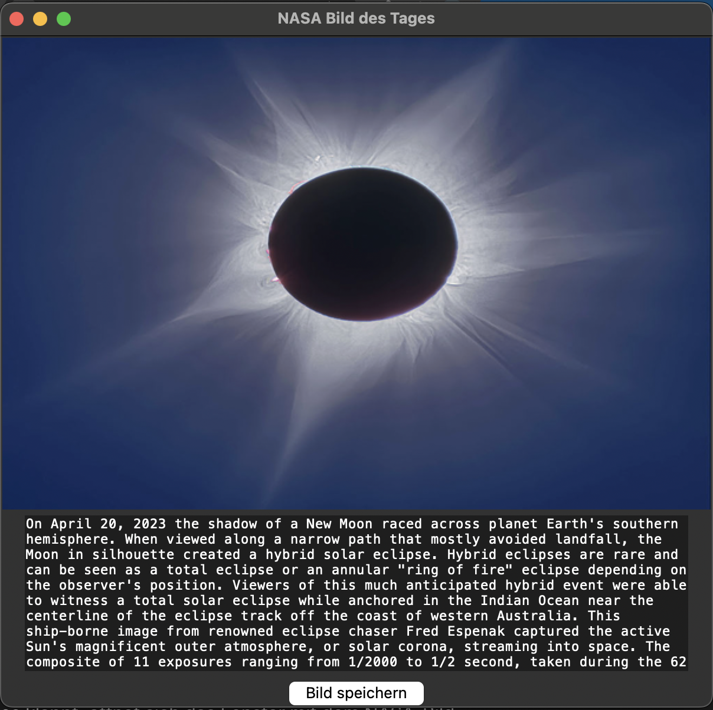

# NASA Picture of the Day Viewer 🚀

A simple Python application that fetches and displays NASA's Astronomy Picture of the Day (APOD) using the official NASA API. Built with `tkinter` and `Pillow`.

## Features
- Fetches NASA's daily image
- Displays image and description in a GUI
- Option to save the image locally

## Installation

1. Clone the repository:
   ```bash
   git clone https://github.com/NoAltF4Dan/nasa-apod-viewer.git
   cd nasa-apod-viewer
   ```

2. Install dependencies:
   ```bash
   pip install -r requirements.txt
   ```

3. Run the script:
   ```bash
   python 02_pic_of_the_day.py
   ```

## API Key

The script uses NASA’s public `DEMO_KEY`. For higher rate limits, get your own API key here:  
🔗 [https://api.nasa.gov](https://api.nasa.gov)

You can export your key as an environment variable:

```bash
export NASA_API_KEY=your_key_here
```

The script will automatically use `DEMO_KEY` if no custom key is set.

## Screenshot



## License

MIT License
